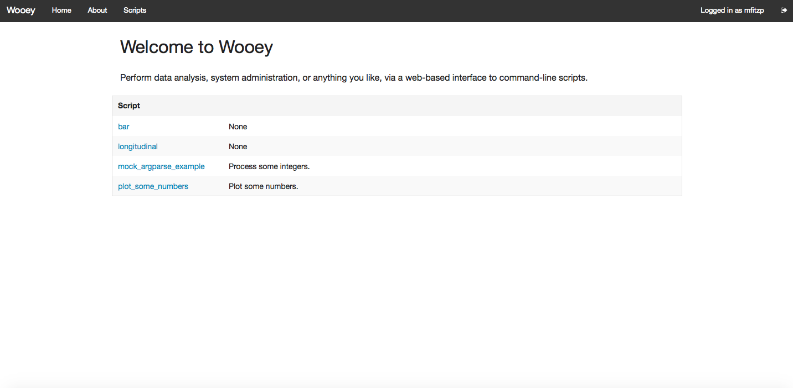
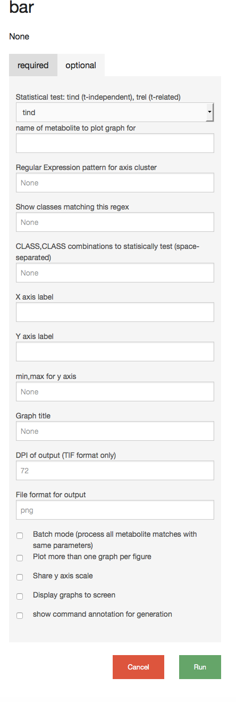
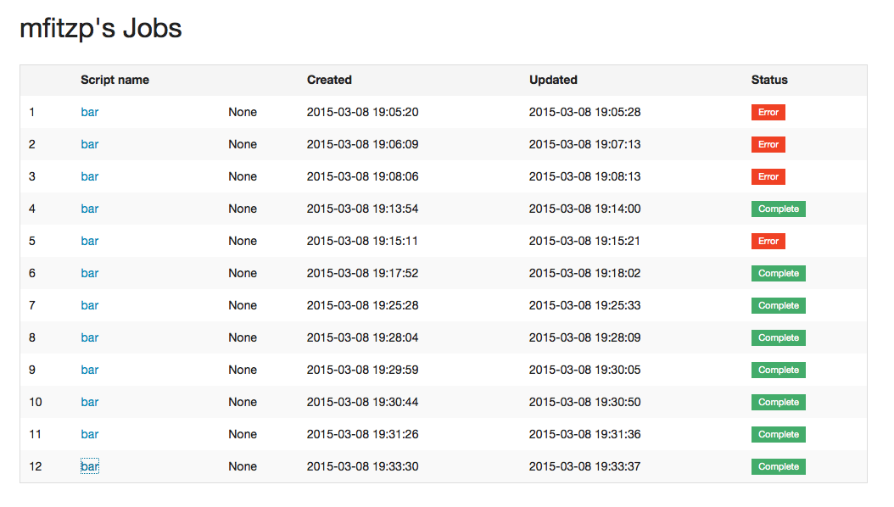

## Wooey-Flask    
-----

**Wooey-Flask** is a prvious version of Wooey and made some changes, because i prefer to use Flask and Bootstarp  

Wooey is a simple web interface (built on Flask) to run command line Python scripts. Think of it as an easy way to get
your scripts up on the web for routine data analysis, file processing, or anything else.

Enjoy and please fork.

Built on Flask, using cookiecutter-flask then modified to use the Foundation framework. This is *My First Flask App!*
so please feel free to critique & give pointers. Thanks.

## Walkthrough

The front page of a wooey install presents a list of installed scripts:

Each script has it's own UI form based on the config parameters defined in the ArgumentParser:

Documentation can be specified either manually via the JSON, or my providing a
[Markdown](http://en.wikipedia.org/wiki/Markdown)-format file alongside the script or config file.

Logged-in users get a nice listing of their previous jobs:

The output from successful jobs is available via an inline viewer (images only presently, .csv support via Pandas to follow):

## Quickstart

First, set your app's secret key as an environment variable. For example, example add the following to ``.bashrc`` or ``.bash_profile``.

    export WOOEY_SECRET='something-really-secret'

Then run the following commands to bootstrap your environment.

    git clone https://github.com/mfitzp/wooey
    cd wooey
    pip install -r requirements/dev.txt

At this state you can either install a DBMS or use SQLite as a developer setup.
Either way, run the following to create your app's database tables and perform the initial migration:

    python manage.py db init
    python manage.py db migrate
    python manage.py db upgrade

To add the example scripts to the database and allow you to test
also run:

    python manage.py build_scripts
    python manage.py find_scripts

This will build (create JSON for Python scripts using argparse) and then add them to the database. You can now start up
the server using:

    python manage.py server

In another shell, start the temporary dev 'daemon' (which is nothing of the sort, yet) using:

    python manage.py start_daemon

This looks for jobs in the queue and executes them in a separate process. It's not clever, and it's ugly, but it
achieves what is needed for a proof of concept. In order to actually run scripts you currently need to be a logged-in
user, so create an account on the website and get started. By default all logged in users can see the admin panel at
present but this will change in future.

## Examples

Once you have run `python manage.py build_scripts` and `python manage.py find_scripts` management commands you'll
get the scripts listed in the web UI. Now you can try them out:

1. Example data is provided in `/data` which you can use with the included `bar.py` script. Select to upload with the
file selector, and enter `Glucose|Fructose` in the 'name of metabolite' field. You'll see 4 plots output from the source data.
2. Using the `plot_some_numbers.py` script enter a list of integers separated by spaces, you'll get two plots based on these numbers.
3. Using the `mock_argparse_example.py` script, enter a list of integers separated by spaces,you'll get the max (or sum, if you select this) output in the console.

## Deployment

In your production environment, make sure the ``WOOEY_ENV`` environment variable is set to ``"prod"``.

## Shell

To open the interactive shell, run:

    python manage.py shell

By default, you will have access to ``app``, ``db``, and the ``User`` model. This can be used to quickly recreate database tables
during development, i.e. delete `dev.db` (SQLite) and then from the shell enter:

    db.create_all()

## Running Tests

To run all tests, run:

    python manage.py test

## Migrations

Whenever a database migration needs to be made. Run the following commmands:

    python manage.py db migrate

This will generate a new migration script. Then run:

    python manage.py db upgrade

To apply the migration.

For a full migration command reference, run ``python manage.py db --help``.

## FAQ

### Isn't this terribly insecure?

That largely depends on what you're scripts do. Wooey will perform some standard form-type checking and validation
before passing to your script as strings. The input is then re-parsed (for Python scripts) via ArgumentParser before being
passed into variables in your script. Scripts are also run without invoking a shell (`exec(shell=False)`) which eliminates
shell-interpretation risks.

That said, if you script does something incredibly silly, like taking unchecked text input and using it
as a path, you're probably going to regret it.
